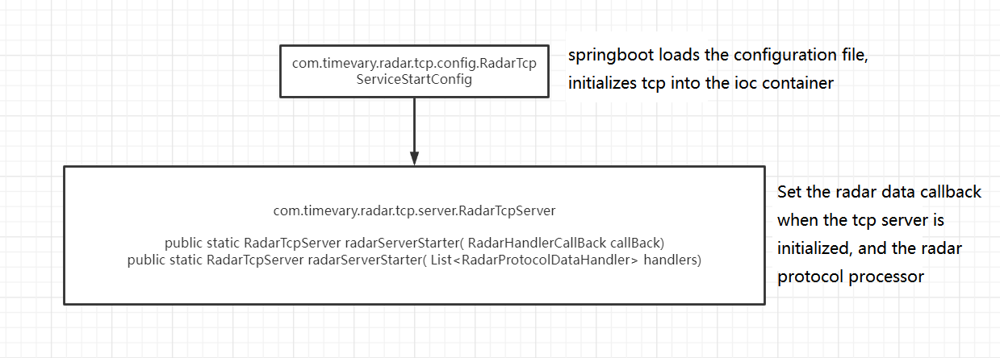
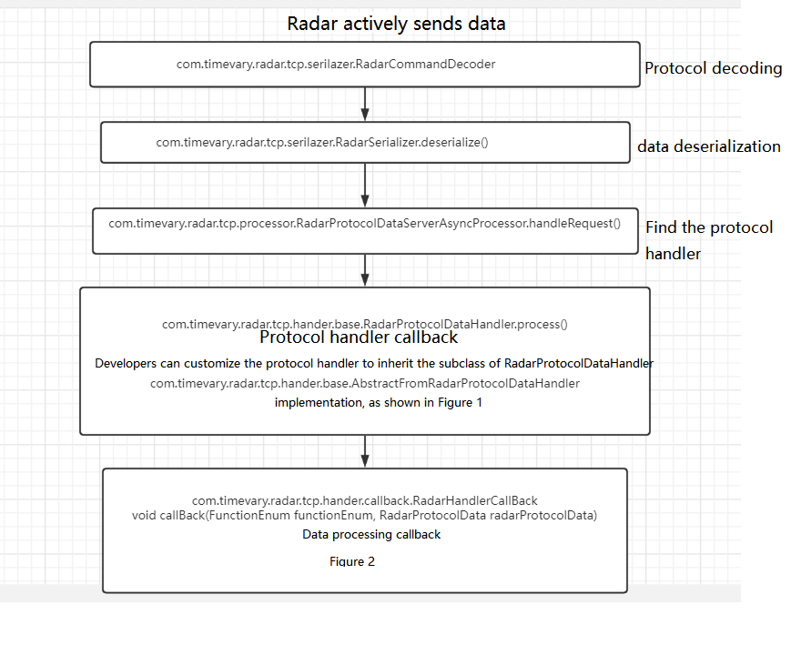
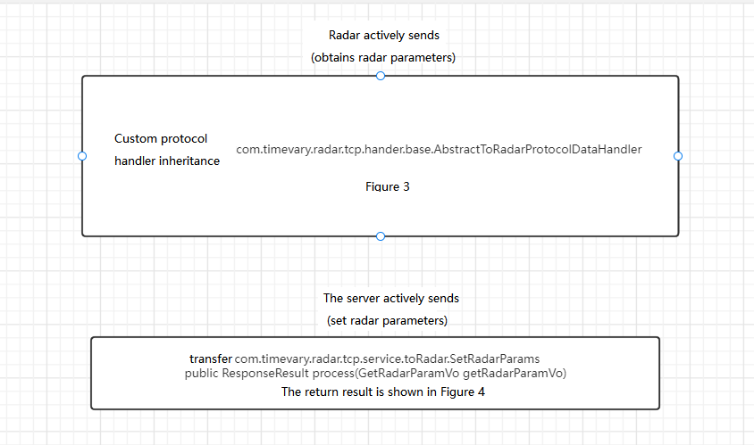
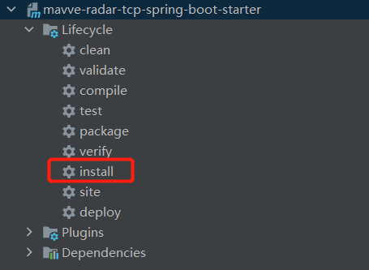
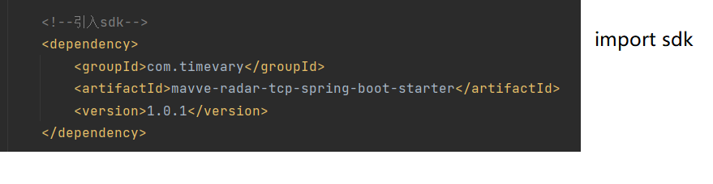
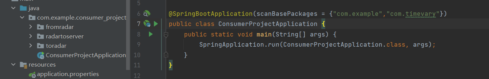
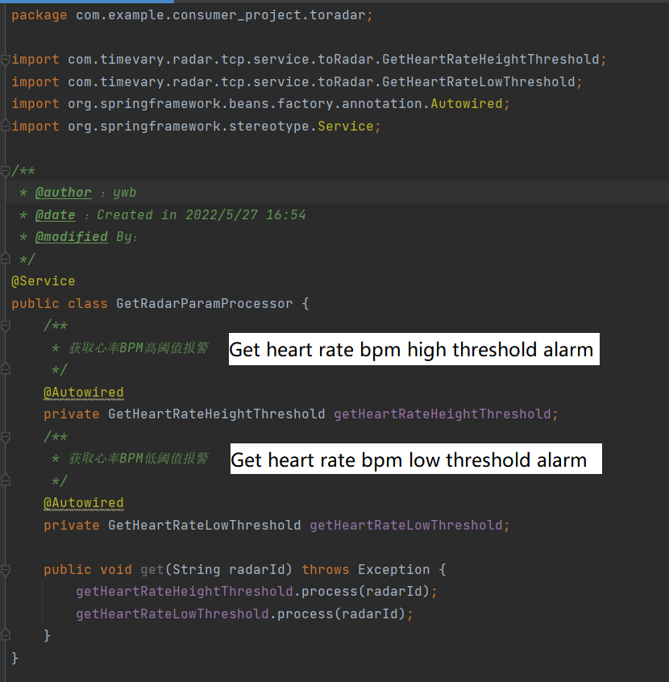
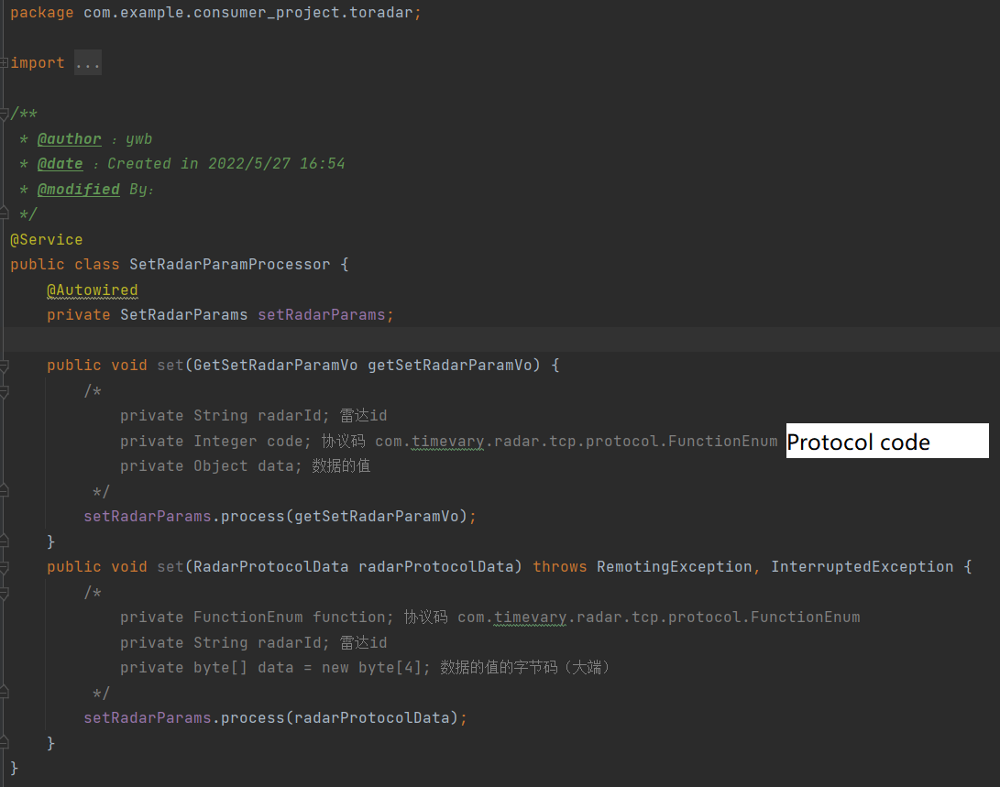

## 一，schema analysis 

### 1， sdk startup flowchart

https://www.processon.com/diagraming/6290877c5653bb788c7a3617



### 2，Radar server interaction flow chart

https://www.processon.com/diagraming/6290877c5653bb788c7a3617



```java

/**
 * @author ：ywb
 * @date ：Created in 2022/1/7 10:35
 * @modified By：
 * Breathing low bpm alarm
 * When the radar actively alarms,it will call the corresponding protocol processor, and then call the radar
 */
@Service
public class BreathLowBpmHandler extends AbstractFromRadarProtocolDataHandler {

    public BreathLowBpmHandler(RadarHandlerCallBack handlerCallBack) {
        super(handlerCallBack);
    }

    @Override
    public Object process(RadarProtocolData protocolData) {
        //process data, no need to return
        protocolData.setFunction(FunctionEnum.breathLowBpmAlert);
        handlerCallBack.callBack(protocolData);
        return null;
    }

    @Override
    public Set<FunctionEnum> interests() {
        return Sets.newHashSet(FunctionEnum.breathLowBpmAlert);
    }
}

```

​																										Figure 1

```java

/**
 * @author ：ywb
 * @date ：Created in 2022/1/7 11:03
 * @modified By：
 * Radar built-in callback class
 * Users need to customize the callback implementation RadarHandlerCallBackForConsumer plus 
 */
@Service
@Slf4j
public class RadarReportOrAlertCallBack implements RadarHandlerCallBack {

    @Autowired(required = false)
    RadarHandlerCallBackForConsumer radarHandlerCallBackForConsumer;

    @Override
    public void callBack(RadarProtocolData radarProtocolData) {
        if (radarHandlerCallBackForConsumer != null) {
            radarHandlerCallBackForConsumer.callBack(radarProtocolData);
        } else {
            throw new RuntimeException("No custom callback");
        }
    }
}

```

​																												Figure 2



```java

/**
 * @author ：ywb
 * @date ：Created in 2022/1/8 17:54
 * @modified By：
 * Get breathing BPM high threshold alarm, the server sends a command to the radar to get the result
 */
@Service
public class GetBreathBpmHeightThreshold extends AbstractToRadarProtocolDataHandler {

    public Integer process(String radarId) throws Exception {
        //Send command to radar and return result
        ByteBuf byteBuf = super.processDo(radarId, FunctionEnum.getBreathBpmHeightThreshold);
        //Read the relevant data according to the radar protocol
        int readInt = byteBuf.readInt();
        byteBuf.release();
        return readInt;
    }

}

```

​																												图3


```java

/**
 * @author ：ywb
 * @date ：Created in 2022/1/7 11:30
 * @modified By：
 * To set the radar parameters, the user injects SetRadarParams and calls 
 * process(GetSetRadarParamVogetRadarParamVo)
 * Time out, or retry 5 times if it fails
 */
@Service
@Slf4j
public class SetRadarParams extends AbstractToRadarProtocolDataHandler {
    @Autowired
    private RadarTcpServer radarTcpServer;

    public ResponseResult process(GetSetRadarParamVo getRadarParamVo) {
        log.debug("set function {}", getRadarParamVo);
        ResponseResult check = RadarCheck.check(getRadarParamVo, radarTcpServer);
        if (check != null) {
            return check;
        }
        try {
            return doSet(getRadarParamVo);
        } catch (Exception e) {
            //may time out
            for (int i = 0; i < 5; i++) {
                try {
                    return doSet(getRadarParamVo);
                } catch (RemotingException | InterruptedException ex) {
                    log.error("Set timeout: {}, retrying...", getRadarParamVo.getCode());
                }
            }
        }
        return new ResponseResult(ResponseCode.SERVER_ERROR);
    }
   .......
}

```

​																											图4


## 二， quick start

### 1，import sdk

```
clone mavve-radar-tcp-spring-boot-starter   git clone sdk
idea open sdk ， configure maven ， install ，introduce maven in your own project ， 
scan com.timevary in startup class
```

​																							Put the sdk on maven coordinates



​																								     import sdk



​																									Startup class scan package




## 三，Startup class scan package

### 1，actively send data to radar（get）



```
For more protocol handlers please see the com.timevary.radar.tcp.service.toRadar package
```

### 2， actively send data to radar（set）

​	


### 3，radar sent to server

The user-defined callback handler is as follows

```java
@Service
@Slf4j
public class RadarReportOrAlertCallBackConsumer implements RadarHandlerCallBackForConsumer {
    @Override
    public void callBack(RadarProtocolData radarProtocolData) {
        switch (radarProtocolData.getFunction()) {
            case createConnection:
                log.info("radar {} connected", radarProtocolData.getRadarId());
                return;
            case radarReport:
                ByteBuf byteBuf = PooledByteBufAllocator.DEFAULT.heapBuffer();
                try {
                    byteBuf.writeBytes(radarProtocolData.getData());
                    float breathBpm = byteBuf.readFloat();
                    float breathLine = byteBuf.readFloat();
                    float heartBpm = byteBuf.readFloat();
                    float heartLine = byteBuf.readFloat();
                    float target = byteBuf.readFloat();
                    float signalIntensity = byteBuf.readFloat();
                    log.info("breathBpm:{}", breathBpm);
                    log.info("breathLine:{}", breathLine);
                    log.info("heartBpm:{}", heartBpm);
                    log.info("heartLine:{}", heartLine);
                    log.info("target:{}", target);
                    log.info("signalIntensity:{}", signalIntensity);
                    break;
               } finally {
                    byteBuf.release();
               }
		    case liveBedNoBack:
				log.info("Out of bed and not returning");
				break;
			case longTimeNoTurnOver:
				log.info("The user hasn't turned over for a long time");
				break;
			case respiratory Arrest:
                log.info("respiratory arrest");
                break;
			case breathLowBpmAlert:
                log.info("below respiratory BPM high threshold");
                break;
			case breathHeightBpmAlert:
                log.info("Above respiratory BPM low threshold");
                break;
			case cardiacArrest:
                log.info("Sudden Cardiac Arrest");
                break;
			case heartRateLowBpm:
                log.info("Below heart rate BPM low threshold");
                break;
			case heartRateHeightBpm:
                log.info("Above heart rate BPM high threshold");
                break;
			case rollOverOrSitAndCallThePolice:
                byte[] data = radarProtocolData.getData();
                ByteBuf buffer = PooledByteBufAllocator.DEFAULT.buffer();
                try {
						buffer.writeBytes(data);
						//0: Turn over to alarm, 1: Sitting and standing alarm
                        int ints = buffer.readInt();
                        if (ints == 0) {
                            log.info("Turn over to alarm");
                        } else {
                            log.info("Sit and Stand Alarm");
                        }
					} finally {
						buffer.release();
					}
				break;
			case physicalActivityReportStatistics:
                //A body movement report statistics, report the cumulative movement energy
                byte[] data1 = radarProtocolData.getData();
                ByteBuf buffer1 = PooledByteBufAllocator.DEFAULT.buffer();
                try {
                    buffer1.writeBytes(data1);
                    //The signal strength of the current body movement
                    float readFloat = buffer1.readFloat();
                    log.info("A body movement report statistics, report the cumulative movement energy");
                } finally {
                	buffer1.release();
                }
                break;
			default:
				log.error("Strange radar report, {}", radarProtocolData);
		}
	}
}
```


## 四，custom protocol processor

### 1，no, because each protocol can only have one processor, so there cannot be multiple

