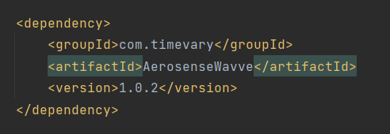
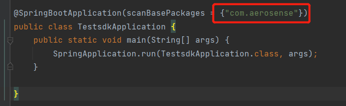
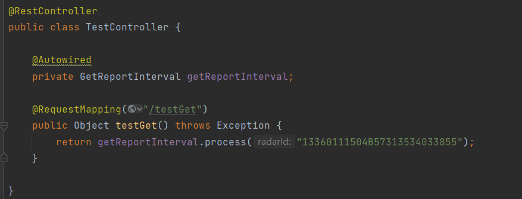
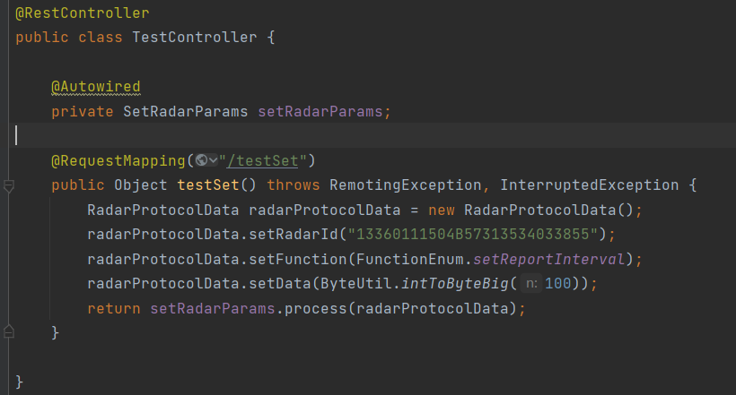
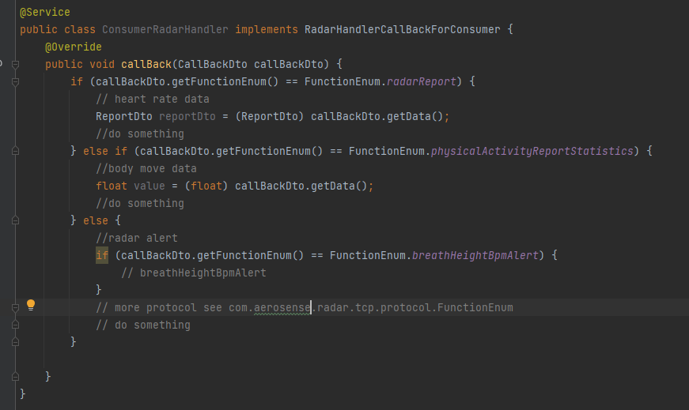

## 1， Quick start

### 1.1， To prepare SDK

```
Use idea to open the current project. Please remember to adjust your own maven.
Then run maven clean and maven install.
```

### 1.2. To load the SDK

```
To create a new radar server project and load the SDK of maven install.
```



## 2.To use the SDK

### 2.1 scan package.



### 2.2 Example codes to send data to the radar (to acquire the radar parameter).



### 2.3 Example codes to send data to the radar (to set the radar parameter). 

​	

```
For more information, please refer to the package com.aerosnese.radar.tcp.service.toRadar
```


### 3.The radar proactively sends data to the server



Look at wavve_ sdk_ example