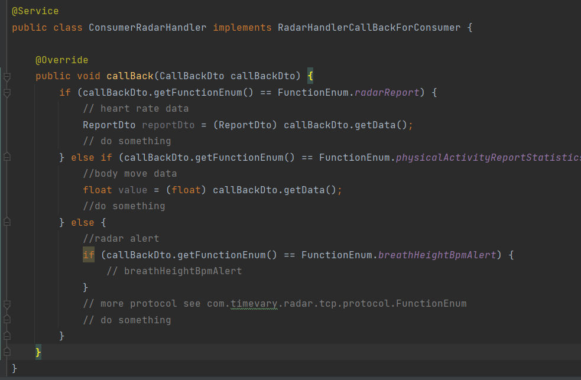

## Ⅰ， quick start

### 1，prepare sdk

```
git clone https://github.com/AeroSenseSw/AeroSenseWavve.git
open in idea , change maven config
maven clean 
maven install 
```

### 2, import sdk

```
create your radar_server
import sdk from your local maven 
```


## 三，Startup class scan package

### 1，actively send data to radar（get radar settings）


### 2， actively send data to radar（set radar settings）

​	

```
For more protocol handlers please see the com.timevary.radar.tcp.service.toRadar package
```


### 3，radar report 



