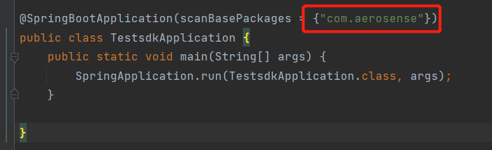
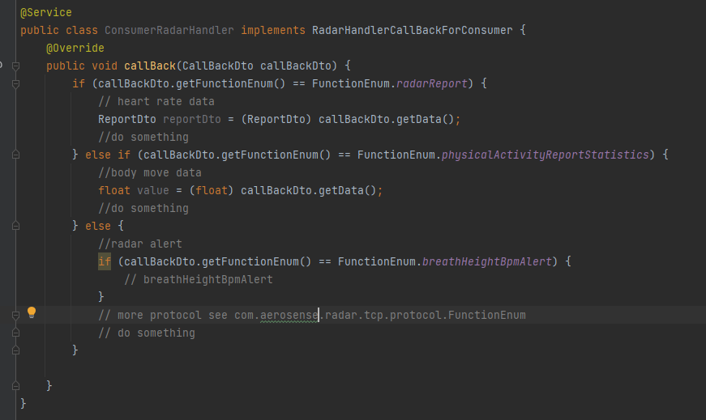

## 1， 快速开始

### 1.1， 准备sdk

```
使用想法打开当前项目。请记住修改自己的maven环境。

然后运行maven clean 和 maven install。
```

### 1.2. 加载adk

```
创建一个新的雷达服务器项目并通过maven install安装SDK。
```


## 2.使用sdk

### 2.1 包扫描。



### 2.2 向雷达发送数据（获取雷达参数）的示例代码。


### 2.3 向雷达发送数据（设置雷达参数）的示例代码。

​	

```
有关更多信息，请参阅包com.aerosnese.radar.tcp.service.toRadar
```


### 3.雷达主动向服务器发送数据



请看wavve_sdk_example